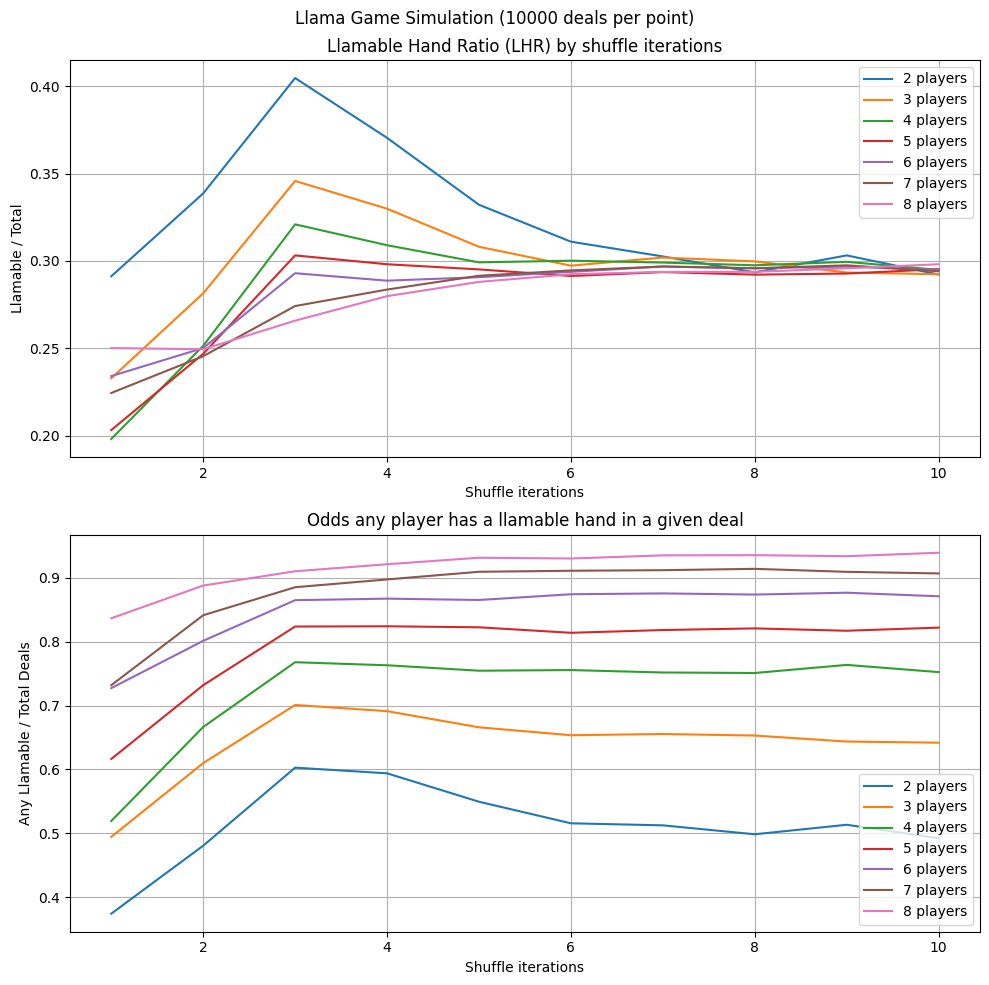

# llama_hand_ratio
Python code to answer a question about the "Don't L.L.A.M.A" card game

## Context

The card came "Don't L.L.A.M.A" is essentially uno with extra rules.
This game is played with a deck of cards containing 8 instances of the following 7 cards: [1, 2, 3, 4, 5, 6, "Llama"]. The game involves playing cards from your hand onto a discard, with the constraint that you must either match the current discard or increment it by 1. The "Llama" card acts as an Ace might in traditional 52 card games, in that it can be played on a 6 and causes wrap-around back to 1. Players take turns discarding a single card, choosing either to match the current discard or play the next in the sequence. Players who cannot discard legally must draw an additional card. Players may also choose to "fold" -- ceasing to participate in the remainder of a round and accepting a penalty points for the cards remaining in their hand. Play continues until all players have folded, or one player discards their entire hand (a feat rewarded by a point bonus).

In some rounds, a single player may find themselves the only one yet to fold. In this situation, that player may continue to discard cards as long as they can, but cannot draw any new cards. If this last remaining player has a consecutive sequence of cards, they are able to play out all their cards and attain the point bonus. If their hand forms such a consecutive sequence, I term this a "llamable" hand. A llamable hand is one which can be arranged to form a consecutive "run", ignoring duplicates and respecting wrap-around.

After playing this game one evening, I was curious about the probability of being dealt a "llamable" hand. Obviously, this probability is not highly relevant to real gameplay, since:
- one will indubitably discard some cards before being the last player standing
- the ability to actually "play out" with a llamable hand is constrained by the current discard inherited by the last player standing

However, I still thought it'd be fun and relatively simple to calculate. After a quick stab at the problem, I realized that a full treatment of edge cases and proper handling of wrap-around in sequence detection would make the problem yet more interesting.

## Code
My approach to this problem is to Monte Carlo the heck out of it. Fortunately, this is a simple enough problem that I didn't need c++ to get a good sample size.

The core of this approach is the following function:
```
def check_llamable(hand):
    # don't judge my lazy ass-erts
    assert len(hand) > 0, f"Hand must have at least one card -- {hand}"
    assert max(hand) <= 6, f"Hand cannot contain cards greater than 6 -- {hand}"
    assert min(hand) >= 0, f"Hand cannot contain cards less than 0 -- {hand}"

    hand.sort()
    deltas = []
    for i in range(len(hand) - 1):
        deltas.append(hand[i+1] - hand[i])

    # wrapparound case
    deltas.append(hand[0] - hand[-1] + 7)

    # check how many deltas are > 1
    # if there are 2 or more, the hand is not llamable
    non_1_deltas = [d for d in deltas if d > 1]
    if len(non_1_deltas) > 1:
        return False
    return True

```
The notion here is to determine llamability in O(n) time (ignoring the sort) by sorting then checking for gaps by computing the delta between consecutive elements.
Duplicates have a delta of 0 and sequential cards a delta of 1. Anything else is a gap. Use a lazy hard coded special case to handle the wrap-around delta calc.
We can allow a single gap (don't need a full ring), but more than 1 means more than one sequence, and thus not llamable.

This approach turned out to be fairly simple, moderately intuitive, and plausibly efficient.


All the code is in the `llama.ipynb` notebook. A couple other notes:
- I use a `Deck` class to simulate a deck of cards, complete with randomized (but human-like) shuffling. This allows us to see how the LHR changes with an under-shuffled deck
- I simulate dealing from the deck so the odds feedback of getting more of what you don't have is in effect.
- Since I'm using a simulated deck, I might as well simulate the all the players as well. This allows us to see the odds of anyone in a given round having a "llamable" hand, rather than just the raw odds of drawing one.
- Theres a section at the end that shows how shuffled a deck gets with different numbers of merges. Fun to play with.

## Results, etc



Note the hump for 3 shuffles. It's surprising that the probability isn't just a simple downward trend...
Also note that the base order is [0,0,...0,1,1,.....1,2,2....]. Re-running this with a starting order that simulates the end of a round would be an interesting next step, though this starting order isn't actually that different...
